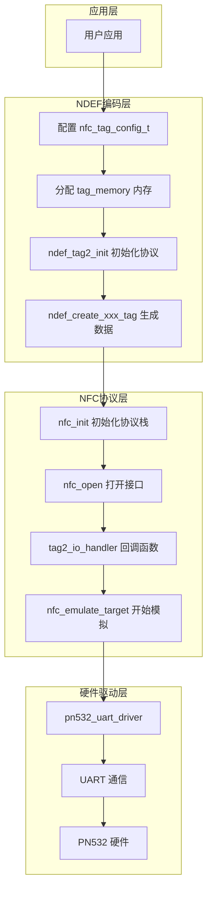
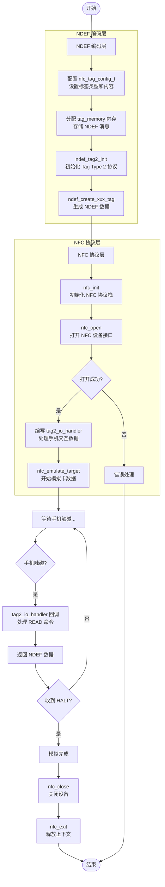
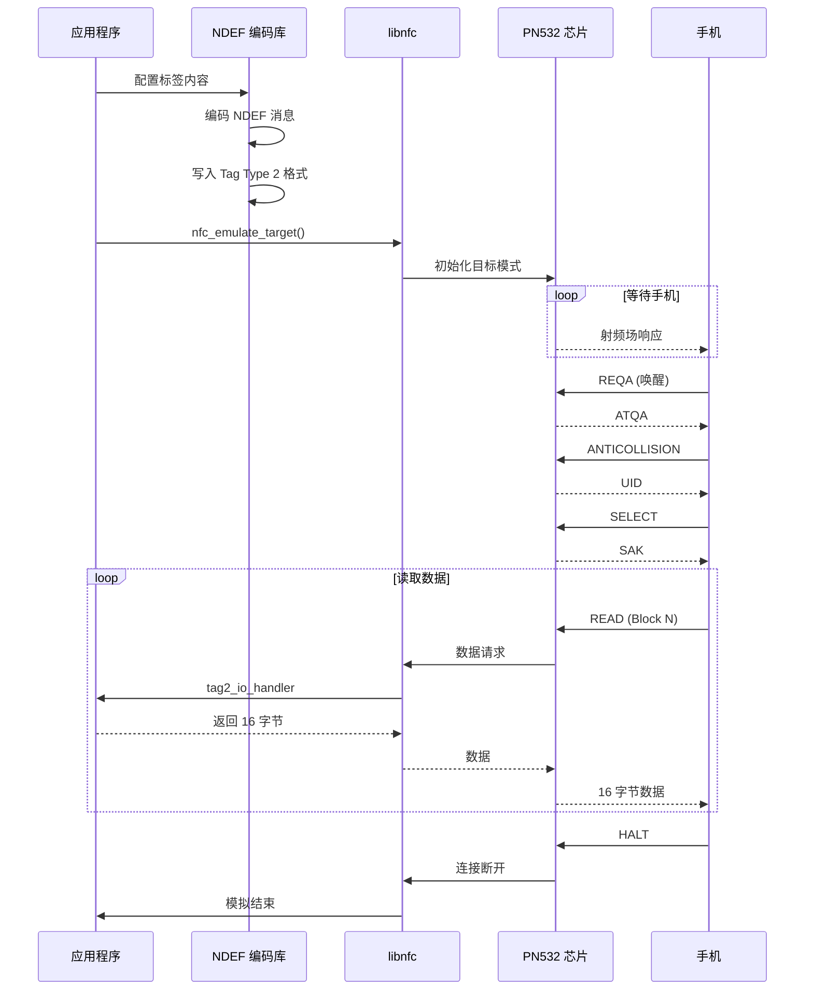

# PN532 NFC 标签模拟示例

本示例演示如何使用 PN532 NFC 模块模拟各种类型的 NFC 标签，支持 Android 和 iOS 设备读取。

---

## 目录

1. [PN532 NFC 模拟能力](#pn532-nfc-模拟能力)
2. [支持的模拟功能](#支持的模拟功能)
3. [硬件连接](#硬件连接)
4. [开发流程](#开发流程)
5. [API 接口说明](#api-接口说明)
6. [使用示例](#使用示例)
7. [平台兼容性](#平台兼容性)

---

## PN532 NFC 模拟能力

### 芯片简介

PN532 是 NXP 公司生产的高度集成的 NFC 收发器模块，支持以下工作模式：

| 模式 | 说明 |
|------|------|
| **读卡器模式 (Reader)** | 读取 NFC 标签/卡片 |
| **卡模拟模式 (Card Emulation)** | 模拟 NFC 标签，被手机读取 |
| **点对点模式 (P2P)** | 与其他 NFC 设备通信 |

### 本示例使用的模式

本示例使用 **卡模拟模式 (Card Emulation)**，将 PN532 模拟成 **NFC Forum Tag Type 2** 标签。

```
┌─────────────────────────────────────────────────────────────┐
│                     NFC 标签模拟原理                         │
├─────────────────────────────────────────────────────────────┤
│                                                             │
│   ┌─────────┐         RF Field          ┌─────────────┐    │
│   │  手机   │ ◄─────────────────────► │   PN532     │    │
│   │ (读卡器) │                          │ (模拟标签)   │    │
│   └─────────┘                          └─────────────┘    │
│                                              │             │
│                                              ▼             │
│                                        ┌─────────┐        │
│                                        │  MCU    │        │
│                                        │ (T5AI)  │        │
│                                        └─────────┘        │
└─────────────────────────────────────────────────────────────┘
```

### 支持的 NFC 标准

| 标准 | 说明 |
|------|------|
| ISO/IEC 14443A | 近场通信协议 |
| NFC Forum Type 2 Tag | 标签类型 (兼容 NTAG/Ultralight) |
| NDEF | NFC 数据交换格式 |

### NDEF 数据结构

```

┌─────────────────────────────────────────────────────────────────────────────┐
│                           NDEF Record (NDEF 记录)                           │
├─────────────────────────────────────────────────────────────────────────────┤
│                                                                             │
│       7      6      5      4      3      2      1      0                    │
│    ┌──────┬──────┬──────┬──────┬──────┬──────────────────┐                  │
│    │  MB  │  ME  │  CF  │  SR  │  IL  │       TNF        │                  │
│    ├──────┴──────┴──────┴──────┴──────┴──────────────────┤                  │
│    │                   TYPE LENGTH                       │                  │
│    ├─────────────────────────────────────────────────────┤                  │
│    │                  PAYLOAD LENGTH                     │                  │
│    ├─ ─ ─ ─ ─ ─ ─ ─ ─ ─ ─ ─ ─ ─ ─ ─ ─ ─ ─ ─ ─ ─ ─ ─ ─ ─ ┤                  │
│    │                   ID LENGTH                         │  (可选, IL=1时)  │
│    ├─ ─ ─ ─ ─ ─ ─ ─ ─ ─ ─ ─ ─ ─ ─ ─ ─ ─ ─ ─ ─ ─ ─ ─ ─ ─ ┤                  │
│    │                      TYPE                           │                  │
│    ├─ ─ ─ ─ ─ ─ ─ ─ ─ ─ ─ ─ ─ ─ ─ ─ ─ ─ ─ ─ ─ ─ ─ ─ ─ ─ ┤                  │
│    │                       ID                            │  (可选, IL=1时)  │
│    ├─ ─ ─ ─ ─ ─ ─ ─ ─ ─ ─ ─ ─ ─ ─ ─ ─ ─ ─ ─ ─ ─ ─ ─ ─ ─ ┤                  │
│    │                    PAYLOAD                          │                  │
│    └─────────────────────────────────────────────────────┘                  │
│                                                                             │
│  标志位说明:                                                                 │
│  ┌─────┬────────────────────────────────────────────────────────────────┐  │
│  │ MB  │ Message Begin - 消息开始标志 (第一条记录为 1)                   │  │
│  │ ME  │ Message End - 消息结束标志 (最后一条记录为 1)                   │  │
│  │ CF  │ Chunk Flag - 分块标志                                          │  │
│  │ SR  │ Short Record - 短记录 (PAYLOAD_LENGTH 为 1 字节, 否则 4 字节)  │  │
│  │ IL  │ ID Length present - ID 长度字段存在                            │  │
│  │ TNF │ Type Name Format - 类型名称格式 (0-7)                          │  │
│  └─────┴────────────────────────────────────────────────────────────────┘  │
│                                                                             │
└─────────────────────────────────────────────────────────────────────────────┘

┌─────────────────────────────────────────────────────────────────────────────┐
│                           TNF 类型定义                                       │
├───────┬─────────────────────────────────────────────────────────────────────┤
│  值   │  说明                                                               │
├───────┼─────────────────────────────────────────────────────────────────────┤
│  0x00 │  Empty (空记录)                                                     │
│  0x01 │  NFC Forum well-known type (URI, Text, Smart Poster 等)            │
│  0x02 │  Media-type (MIME 类型, 如 WiFi 配置)                               │
│  0x03 │  Absolute URI                                                       │
│  0x04 │  NFC Forum external type (AAR 等)                                   │
│  0x05 │  Unknown                                                            │
│  0x06 │  Unchanged                                                          │
│  0x07 │  Reserved                                                           │
└───────┴─────────────────────────────────────────────────────────────────────┘
```

---

## 支持的模拟功能

本示例通过 NDEF 编码库支持以下标签类型：

### 1. URI 标签 (网址/电话/邮件)

| 类型 | 前缀 | 示例 |
|------|------|------|
| 网页链接 | `https://` | `https://tuyaopen.ai` |
| 电话号码 | `tel:` | `tel:+8613800138000` |
| 邮箱地址 | `mailto:` | `mailto:example@example.com` |
| FTP 链接 | `ftp://` | `ftp://files.example.com` |

### 2. WiFi 配置标签

手机触碰即可自动连接 WiFi，支持：

| 认证类型 | 加密类型 |
|----------|----------|
| WPA-PSK | TKIP |
| WPA2-PSK | AES (CCMP) |
| WPA/WPA2 混合 | AES + TKIP |
| 开放网络 | 无加密 |

### 3. 文本标签 (Text)

支持多语言文本，语言代码遵循 ISO 639-1 标准：
- `en` - 英语
- `zh` - 中文
- `ja` - 日语

### 4. 联系人标签 (vCard)

支持的字段：

| 字段 | 说明 |
|------|------|
| FN/N | 姓名 |
| TEL | 电话号码 |
| EMAIL | 电子邮箱 |
| ORG | 组织/公司 |
| TITLE | 职位 |
| URL | 网站 |
| ADR | 地址 |
| NOTE | 备注 |

### 5. 智能海报 (Smart Poster)

组合 URI 和标题文本，提供更丰富的信息展示。

### 6. Android 应用记录 (AAR)

强制 Android 设备打开指定应用，防止其他应用拦截 NFC 事件。

---

## 硬件连接

### 引脚配置

硬件驱动配置在 `src/peripherals/nfc/pn532/src/buses/uart.c` 文件中，波特率默认是 115200。

| PN532 引脚 | T5AI 引脚 | 说明 |
|------------|-----------|------|
| VCC | 3.3V | 电源 |
| GND | GND | 地 |
| TXD | PIN40 (UART2_RX) | PN532 发送 → MCU 接收 |
| RXD | PIN41 (UART2_TX) | MCU 发送 → PN532 接收 |

### PN532 模式选择

PN532 需要设置为 **HSU (High Speed UART)** 模式：

| I0 | I1 | 模式 |
|----|----|----|
| 0 | 0 | **HSU (UART)** ✓ |
| 1 | 0 | I2C |
| 0 | 1 | SPI |

---

## 开发流程

### 整体架构



### 开发步骤详解

#### 步骤 1: NDEF 编码层

NDEF 编码接口文件：`src/peripherals/nfc/pn532/inc/ndef/ndef.h`

```c
// 1.1 配置标签内容
nfc_tag_config_t config = {
    .type = NFC_TAG_TYPE_URI,
    .uri = {
        .uri = "https://tuyaopen.ai",
        .aar_package = NULL
    }
};

// 1.2 分配 tag_memory 内存
tag_memory = tal_psram_malloc(buffer_size);

// 1.3 初始化 Tag Type 2 协议层
ndef_tag2_init(tag_memory, buffer_size);

// 1.4 生成 NDEF 数据
ndef_create_<xxx>_tag(&config, ···);
```

#### 步骤 2: NFC 协议层

NFC 协议接口文件：`src/peripherals/nfc/pn532/inc/nfc/nfc.h`

```c
// 2.1 初始化 NFC 协议栈
nfc_context *context;
nfc_init(&context);

// 2.2 打开 NFC 设备接口
nfc_device *device = nfc_open(context, NULL);
if (device == NULL) {
    // 错误处理
}

// 2.3 编写 tag2_io_handler 回调函数
static int tag2_io_handler(struct nfc_emulator *emulator, const uint8_t *data_in, const size_t data_in_len, uint8_t *data_out, const size_t data_out_len)
{
    // ...
    return 0;
}

// 2.4 开始模拟 NFC 卡
struct nfc_emulator emulator = {
    .target        = &nt,
    .state_machine = &state_machine,
    .user_data     = tag_memory,
};
nfc_emulate_target(pnd, &emulator, 0));
```

### 开发流程图



### 数据流程



---

## API 接口说明

### 核心接口

#### 1. 模拟标签 (通用接口)

```c
OPERATE_RET nfc_emulate_tag(const nfc_tag_config_t *config);
```

| 参数 | 类型 | 说明 |
|------|------|------|
| config | `nfc_tag_config_t*` | 标签配置结构体 |
| 返回值 | `OPERATE_RET` | `OPRT_OK` 成功 |

#### 2. 标签配置结构体

```c
typedef struct {
    nfc_tag_type_t type;  // 标签类型
    union {
        struct { const char *uri; const char *aar_package; } uri;
        struct { const char *ssid; const char *password; 
                 ndef_wifi_auth_t auth_type; ndef_wifi_encr_t encr_type; } wifi;
        struct { const char *text; const char *lang; } text;
        ndef_vcard_config_t vcard;
        struct { const char *uri; const char *title; } smart_poster;
    };
} nfc_tag_config_t;
```

### 便捷接口

| 函数 | 说明 |
|------|------|
| `nfc_demo_uri_tag(uri, aar_package)` | 创建 URI 标签 |
| `nfc_demo_wifi_tag(ssid, password)` | 创建 WiFi 配置标签 |
| `nfc_demo_text_tag(text, lang)` | 创建文本标签 |
| `nfc_demo_vcard_tag()` | 创建联系人标签 |
| `nfc_demo_smart_poster_tag(uri, title)` | 创建智能海报标签 |

### NDEF 编码接口

| 函数 | 说明 |
|------|------|
| `ndef_tag2_init(tag, buffer, size)` | 初始化 Tag Type 2 |
| `ndef_create_uri_tag(tag, uri)` | 创建 URI 标签数据 |
| `ndef_create_wifi_tag(tag, ssid, pass, auth, encr)` | 创建 WiFi 标签数据 |
| `ndef_create_text_tag(tag, text, lang)` | 创建文本标签数据 |
| `ndef_create_vcard_tag(tag, config)` | 创建联系人标签数据 |
| `ndef_create_smart_poster_tag(tag, uri, title)` | 创建智能海报数据 |
| `ndef_create_uri_aar_tag(tag, uri, package)` | 创建 URI+AAR 标签 |

---

## 使用示例

### 示例 1: 创建网址标签

```c
#include "ndef.h"

// 方法1: 使用便捷接口
nfc_demo_uri_tag("https://tuyaopen.ai", NULL);

// 方法2: 使用配置结构体
nfc_tag_config_t config = {
    .type = NFC_TAG_TYPE_URI,
    .uri = {
        .uri = "https://tuyaopen.ai",
        .aar_package = NULL  // 不使用 AAR
    }
};
nfc_emulate_tag(&config);
```

### 示例 2: 创建 WiFi 配置标签

```c
nfc_tag_config_t config = {
    .type = NFC_TAG_TYPE_WIFI,
    .wifi = {
        .ssid      = "TuyaOpen",
        .password  = "12345678",
        .auth_type = NDEF_WIFI_AUTH_WPA2_PERSONAL,
        .encr_type = NDEF_WIFI_ENCR_AES
    }
};
nfc_emulate_tag(&config);
```

### 示例 3: 创建联系人标签

```c
nfc_tag_config_t config = {
    .type = NFC_TAG_TYPE_VCARD,
    .vcard = {
        .name    = "涂鸦智能",
        .phone   = "+86-571-12345678",
        .email   = "support@tuya.com",
        .org     = "Tuya Inc.",
        .title   = "技术支持",
        .url     = "https://www.tuya.com",
        .address = "浙江省杭州市",
        .note    = "IoT 智能平台"
    }
};
nfc_emulate_tag(&config);
```

### 示例 4: 创建带 AAR 的网址标签

```c
// AAR 可以防止其他应用拦截 NFC 事件
// 强制使用 Chrome 浏览器打开
nfc_tag_config_t config = {
    .type = NFC_TAG_TYPE_URI_AAR,
    .uri = {
        .uri = "https://tuyaopen.ai",
        .aar_package = "com.android.chrome"
    }
};
nfc_emulate_tag(&config);
```

---

## 平台兼容性

### Android

| 功能 | 支持情况 | 最低版本 |
|------|----------|----------|
| URI 标签 | ✅ 完全支持 | Android 4.0+ |
| WiFi 配置 | ✅ 完全支持 | Android 5.0+ |
| 文本标签 | ✅ 完全支持 | Android 4.0+ |
| 联系人 (vCard) | ✅ 完全支持 | Android 4.0+ |
| 智能海报 | ✅ 完全支持 | Android 4.0+ |
| AAR | ✅ 完全支持 | Android 4.0+ |

### iOS

> **注意**: iOS 只支持 URI 标签。

---

### 操作说明

- 执行程序，打开手机的 NFC 功能，使用手机触碰 PN532 天线区域

---

### 调试说明

打开 `src/peripherals/nfc/pn532/inc/core/nfc_config.h` 宏定义启用调试。

```c
#define LOG 1
#define NFC_DEBUG 1
```