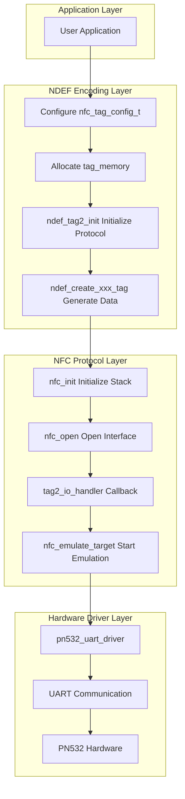
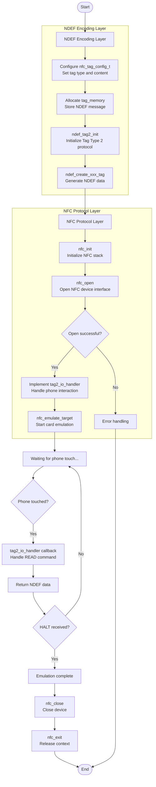
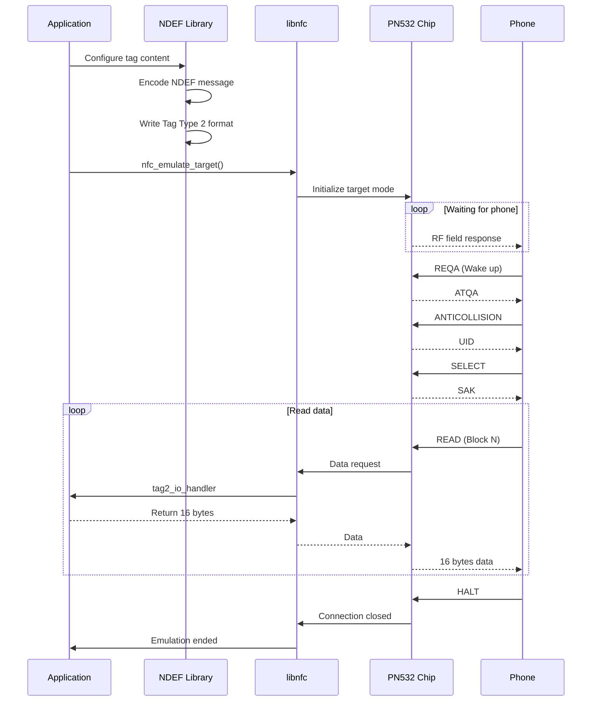

# PN532 NFC Tag Emulation Example

This example demonstrates how to use the PN532 NFC module to emulate various types of NFC tags, supporting both Android and iOS devices.

---

## Table of Contents

1. [PN532 NFC Emulation Capabilities](#pn532-nfc-emulation-capabilities)
2. [Supported Emulation Features](#supported-emulation-features)
3. [Hardware Connection](#hardware-connection)
4. [Development Process](#development-process)
5. [API Reference](#api-reference)
6. [Usage Examples](#usage-examples)
7. [Platform Compatibility](#platform-compatibility)

---

## PN532 NFC Emulation Capabilities

### Chip Overview

The PN532 is a highly integrated NFC transceiver module manufactured by NXP, supporting the following operating modes:

| Mode | Description |
|------|-------------|
| **Reader Mode** | Read NFC tags/cards |
| **Card Emulation Mode** | Emulate NFC tags, readable by phones |
| **Peer-to-Peer Mode (P2P)** | Communicate with other NFC devices |

### Mode Used in This Example

This example uses **Card Emulation Mode**, emulating the PN532 as an **NFC Forum Tag Type 2** tag.

```
┌─────────────────────────────────────────────────────────────┐
│                   NFC Tag Emulation Principle               │
├─────────────────────────────────────────────────────────────┤
│                                                             │
│   ┌─────────┐         RF Field          ┌─────────────┐    │
│   │  Phone  │ ◄─────────────────────► │   PN532     │    │
│   │ (Reader)│                          │ (Emulated   │    │
│   └─────────┘                          │    Tag)     │    │
│                                        └─────────────┘    │
│                                              │             │
│                                              ▼             │
│                                        ┌─────────┐        │
│                                        │  MCU    │        │
│                                        │ (T5AI)  │        │
│                                        └─────────┘        │
└─────────────────────────────────────────────────────────────┘
```

### Supported NFC Standards

| Standard | Description |
|----------|-------------|
| ISO/IEC 14443A | Near Field Communication Protocol |
| NFC Forum Type 2 Tag | Tag Type (compatible with NTAG/Ultralight) |
| NDEF | NFC Data Exchange Format |

### NDEF Data Structure

```

┌─────────────────────────────────────────────────────────────────────────────┐
│                              NDEF Record                                    │
├─────────────────────────────────────────────────────────────────────────────┤
│                                                                             │
│       7      6      5      4      3      2      1      0                    │
│    ┌──────┬──────┬──────┬──────┬──────┬──────────────────┐                  │
│    │  MB  │  ME  │  CF  │  SR  │  IL  │       TNF        │                  │
│    ├──────┴──────┴──────┴──────┴──────┴──────────────────┤                  │
│    │                   TYPE LENGTH                       │                  │
│    ├─────────────────────────────────────────────────────┤                  │
│    │                  PAYLOAD LENGTH                     │                  │
│    ├─ ─ ─ ─ ─ ─ ─ ─ ─ ─ ─ ─ ─ ─ ─ ─ ─ ─ ─ ─ ─ ─ ─ ─ ─ ─ ┤                  │
│    │                   ID LENGTH                         │  (Optional,IL=1) │
│    ├─ ─ ─ ─ ─ ─ ─ ─ ─ ─ ─ ─ ─ ─ ─ ─ ─ ─ ─ ─ ─ ─ ─ ─ ─ ─ ┤                  │
│    │                      TYPE                           │                  │
│    ├─ ─ ─ ─ ─ ─ ─ ─ ─ ─ ─ ─ ─ ─ ─ ─ ─ ─ ─ ─ ─ ─ ─ ─ ─ ─ ┤                  │
│    │                       ID                            │  (Optional,IL=1) │
│    ├─ ─ ─ ─ ─ ─ ─ ─ ─ ─ ─ ─ ─ ─ ─ ─ ─ ─ ─ ─ ─ ─ ─ ─ ─ ─ ┤                  │
│    │                    PAYLOAD                          │                  │
│    └─────────────────────────────────────────────────────┘                  │
│                                                                             │
│  Flag Descriptions:                                                         │
│  ┌─────┬────────────────────────────────────────────────────────────────┐  │
│  │ MB  │ Message Begin - First record in message (set to 1)             │  │
│  │ ME  │ Message End - Last record in message (set to 1)                │  │
│  │ CF  │ Chunk Flag - Indicates chunked payload                         │  │
│  │ SR  │ Short Record - PAYLOAD_LENGTH is 1 byte, otherwise 4 bytes     │  │
│  │ IL  │ ID Length present - ID LENGTH field is present                 │  │
│  │ TNF │ Type Name Format - Type name format (0-7)                      │  │
│  └─────┴────────────────────────────────────────────────────────────────┘  │
│                                                                             │
└─────────────────────────────────────────────────────────────────────────────┘

┌─────────────────────────────────────────────────────────────────────────────┐
│                           TNF Type Definitions                              │
├───────┬─────────────────────────────────────────────────────────────────────┤
│ Value │  Description                                                        │
├───────┼─────────────────────────────────────────────────────────────────────┤
│  0x00 │  Empty record                                                       │
│  0x01 │  NFC Forum well-known type (URI, Text, Smart Poster, etc.)         │
│  0x02 │  Media-type (MIME type, e.g., WiFi configuration)                  │
│  0x03 │  Absolute URI                                                       │
│  0x04 │  NFC Forum external type (AAR, etc.)                               │
│  0x05 │  Unknown                                                            │
│  0x06 │  Unchanged                                                          │
│  0x07 │  Reserved                                                           │
└───────┴─────────────────────────────────────────────────────────────────────┘
```

---

## Supported Emulation Features

This example supports the following tag types through the NDEF encoding library:

### 1. URI Tags (URLs/Phone/Email)

| Type | Prefix | Example |
|------|--------|---------|
| Web Link | `https://` | `https://tuyaopen.ai` |
| Phone Number | `tel:` | `tel:+8613800138000` |
| Email Address | `mailto:` | `mailto:example@example.com` |
| FTP Link | `ftp://` | `ftp://files.example.com` |

### 2. WiFi Configuration Tags

Touch to automatically connect to WiFi, supporting:

| Authentication Type | Encryption Type |
|---------------------|-----------------|
| WPA-PSK | TKIP |
| WPA2-PSK | AES (CCMP) |
| WPA/WPA2 Mixed | AES + TKIP |
| Open Network | No Encryption |

### 3. Text Tags

Supports multi-language text, language codes follow ISO 639-1 standard:
- `en` - English
- `zh` - Chinese
- `ja` - Japanese

### 4. Contact Tags (vCard)

Supported fields:

| Field | Description |
|-------|-------------|
| FN/N | Name |
| TEL | Phone Number |
| EMAIL | Email Address |
| ORG | Organization/Company |
| TITLE | Job Title |
| URL | Website |
| ADR | Address |
| NOTE | Notes |

### 5. Smart Poster

Combines URI and title text for richer information display.

### 6. Android Application Record (AAR)

Forces Android devices to open a specific application, preventing other apps from intercepting NFC events.

---

## Hardware Connection

### Pin Configuration

Hardware driver configuration is in `src/peripherals/nfc/pn532/src/buses/uart.c`, default baud rate is 115200.

| PN532 Pin | T5AI Pin | Description |
|-----------|----------|-------------|
| VCC | 3.3V | Power |
| GND | GND | Ground |
| TXD | PIN40 (UART2_RX) | PN532 TX → MCU RX |
| RXD | PIN41 (UART2_TX) | MCU TX → PN532 RX |

### PN532 Mode Selection

PN532 needs to be set to **HSU (High Speed UART)** mode:

| I0 | I1 | Mode |
|----|----|----|
| 0 | 0 | **HSU (UART)** ✓ |
| 1 | 0 | I2C |
| 0 | 1 | SPI |

---

## Development Process

### Overall Architecture



### Development Steps

#### Step 1: NDEF Encoding Layer

NDEF encoding interface file: `src/peripherals/nfc/pn532/inc/ndef/ndef.h`

```c
// 1.1 Configure tag content
nfc_tag_config_t config = {
    .type = NFC_TAG_TYPE_URI,
    .uri = {
        .uri = "https://tuyaopen.ai",
        .aar_package = NULL
    }
};

// 1.2 Allocate tag_memory
tag_memory = tal_psram_malloc(buffer_size);

// 1.3 Initialize Tag Type 2 protocol layer
ndef_tag2_init(tag_memory, buffer_size);

// 1.4 Generate NDEF data
ndef_create_<xxx>_tag(&config, ···);
```

#### Step 2: NFC Protocol Layer

NFC protocol interface file: `src/peripherals/nfc/pn532/inc/nfc/nfc.h`

```c
// 2.1 Initialize NFC protocol stack
nfc_context *context;
nfc_init(&context);

// 2.2 Open NFC device interface
nfc_device *device = nfc_open(context, NULL);
if (device == NULL) {
    // Error handling
}

// 2.3 Implement tag2_io_handler callback function
static int tag2_io_handler(struct nfc_emulator *emulator, const uint8_t *data_in, const size_t data_in_len, uint8_t *data_out, const size_t data_out_len)
{
    // ...
    return 0;
}

// 2.4 Start NFC card emulation
struct nfc_emulator emulator = {
    .target        = &nt,
    .state_machine = &state_machine,
    .user_data     = tag_memory,
};
nfc_emulate_target(pnd, &emulator, 0));
```

### Development Flowchart



### Data Flow



---

## API Reference

### Core Interfaces

#### 1. Emulate Tag (General Interface)

```c
OPERATE_RET nfc_emulate_tag(const nfc_tag_config_t *config);
```

| Parameter | Type | Description |
|-----------|------|-------------|
| config | `nfc_tag_config_t*` | Tag configuration structure |
| Return | `OPERATE_RET` | `OPRT_OK` on success |

#### 2. Tag Configuration Structure

```c
typedef struct {
    nfc_tag_type_t type;  // Tag type
    union {
        struct { const char *uri; const char *aar_package; } uri;
        struct { const char *ssid; const char *password; 
                 ndef_wifi_auth_t auth_type; ndef_wifi_encr_t encr_type; } wifi;
        struct { const char *text; const char *lang; } text;
        ndef_vcard_config_t vcard;
        struct { const char *uri; const char *title; } smart_poster;
    };
} nfc_tag_config_t;
```

### Convenience Interfaces

| Function | Description |
|----------|-------------|
| `nfc_demo_uri_tag(uri, aar_package)` | Create URI tag |
| `nfc_demo_wifi_tag(ssid, password)` | Create WiFi configuration tag |
| `nfc_demo_text_tag(text, lang)` | Create text tag |
| `nfc_demo_vcard_tag()` | Create contact tag |
| `nfc_demo_smart_poster_tag(uri, title)` | Create smart poster tag |

### NDEF Encoding Interfaces

| Function | Description |
|----------|-------------|
| `ndef_tag2_init(tag, buffer, size)` | Initialize Tag Type 2 |
| `ndef_create_uri_tag(tag, uri)` | Create URI tag data |
| `ndef_create_wifi_tag(tag, ssid, pass, auth, encr)` | Create WiFi tag data |
| `ndef_create_text_tag(tag, text, lang)` | Create text tag data |
| `ndef_create_vcard_tag(tag, config)` | Create contact tag data |
| `ndef_create_smart_poster_tag(tag, uri, title)` | Create smart poster data |
| `ndef_create_uri_aar_tag(tag, uri, package)` | Create URI+AAR tag |

---

## Usage Examples

### Example 1: Create URL Tag

```c
#include "ndef.h"

// Method 1: Use convenience interface
nfc_demo_uri_tag("https://tuyaopen.ai", NULL);

// Method 2: Use configuration structure
nfc_tag_config_t config = {
    .type = NFC_TAG_TYPE_URI,
    .uri = {
        .uri = "https://tuyaopen.ai",
        .aar_package = NULL  // Don't use AAR
    }
};
nfc_emulate_tag(&config);
```

### Example 2: Create WiFi Configuration Tag

```c
nfc_tag_config_t config = {
    .type = NFC_TAG_TYPE_WIFI,
    .wifi = {
        .ssid      = "TuyaOpen",
        .password  = "12345678",
        .auth_type = NDEF_WIFI_AUTH_WPA2_PERSONAL,
        .encr_type = NDEF_WIFI_ENCR_AES
    }
};
nfc_emulate_tag(&config);
```

### Example 3: Create Contact Tag

```c
nfc_tag_config_t config = {
    .type = NFC_TAG_TYPE_VCARD,
    .vcard = {
        .name    = "Tuya Smart",
        .phone   = "+86-571-12345678",
        .email   = "support@tuya.com",
        .org     = "Tuya Inc.",
        .title   = "Technical Support",
        .url     = "https://www.tuya.com",
        .address = "Hangzhou, Zhejiang, China",
        .note    = "IoT Smart Platform"
    }
};
nfc_emulate_tag(&config);
```

### Example 4: Create URL Tag with AAR

```c
// AAR prevents other apps from intercepting NFC events
// Force Chrome browser to open
nfc_tag_config_t config = {
    .type = NFC_TAG_TYPE_URI_AAR,
    .uri = {
        .uri = "https://tuyaopen.ai",
        .aar_package = "com.android.chrome"
    }
};
nfc_emulate_tag(&config);
```

---

## Platform Compatibility

### Android

| Feature | Support | Minimum Version |
|---------|---------|-----------------|
| URI Tag | ✅ Fully Supported | Android 4.0+ |
| WiFi Configuration | ✅ Fully Supported | Android 5.0+ |
| Text Tag | ✅ Fully Supported | Android 4.0+ |
| Contact (vCard) | ✅ Fully Supported | Android 4.0+ |
| Smart Poster | ✅ Fully Supported | Android 4.0+ |
| AAR | ✅ Fully Supported | Android 4.0+ |

### iOS

> **Note**: iOS only supports URI tags.

---

### Operating Instructions

- Run the program, enable NFC on your phone, and touch the phone to the PN532 antenna area

---

### Debug Instructions

Enable debugging by setting macros in `src/peripherals/nfc/pn532/inc/core/nfc_config.h`:

```c
#define LOG 1
#define NFC_DEBUG 1
```
